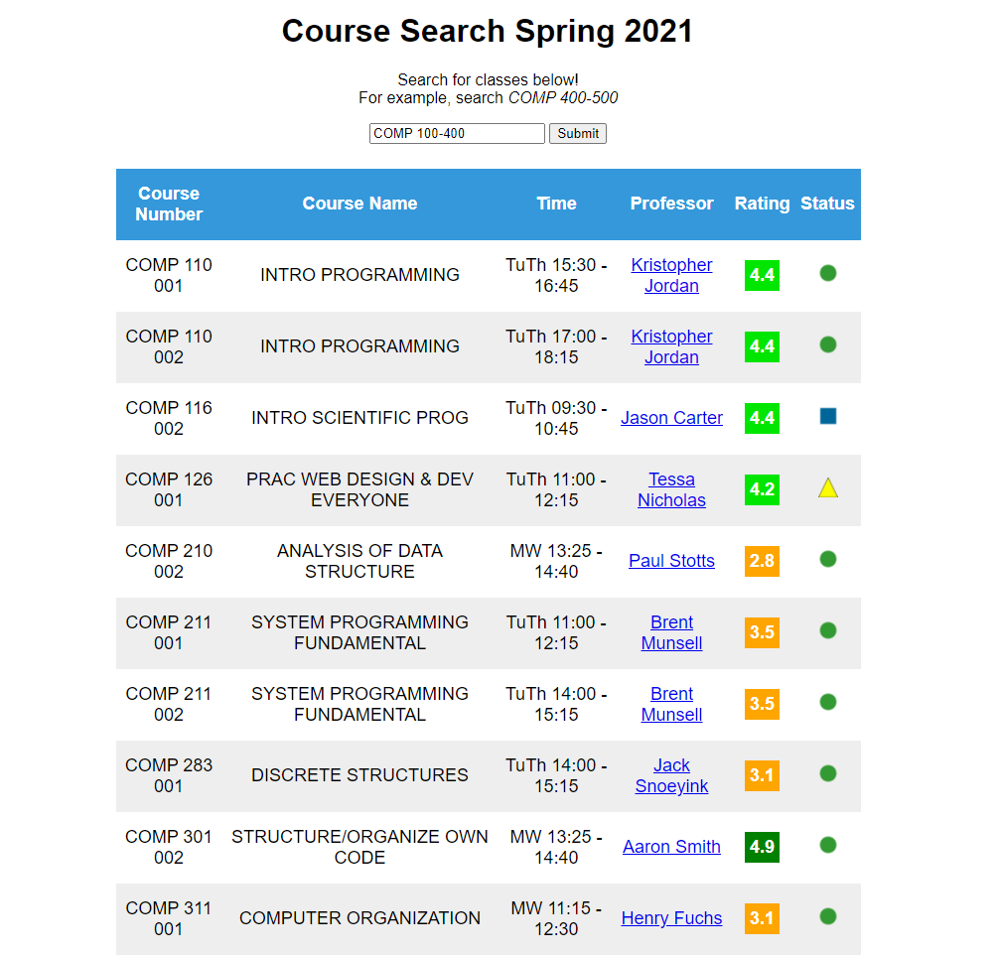

## About
This website allows you to view course information along with professors ratemyprofessors.com rating. I used this to help save time when choosing classes for the 2020/2021 school year.

## How to Use

Using this app is simple. Just open ```html-css-javascript/index.html``` and search for courses using the search bar. You can view professors' scores in the table and click on their name to see what people had to say about them. 



### About the data

I downloaded the course information directly from unc's website here: ```https://registrar.unc.edu/courses/schedule-of-classes/directory-of-classes-2/.```
Then, I converted it from .pdf to .txt on ```zamzar.com``` so that I could parse the data into json. I have not updated the data since spring 2021; however, it would be relatively easy to update it by downloading the latest course information, converting it, and running ```./generate-course-data.sh```.
